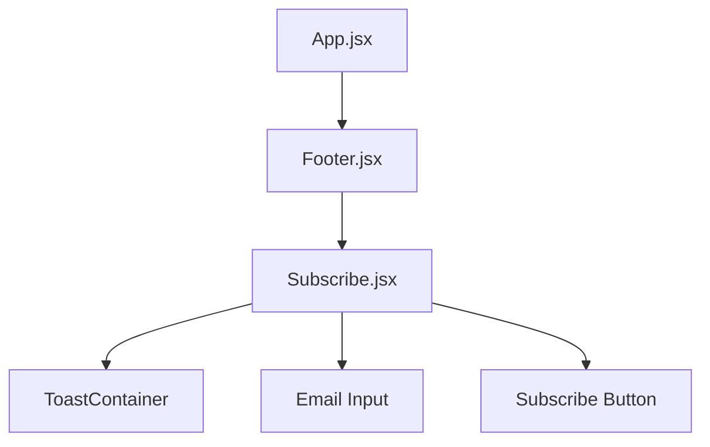

# 🏏 BPL Dream 11 - Ultimate Cricket Team Builder

<div align="center">


[](https://opensource.org/licenses/MIT)


</div>

---

## 📋 Table of Contents
- [About The Project](#-about-the-project)
- [Features](#-features)
- [Tech Stack](#-tech-stack)
- [Project Structure](#-project-structure)
- [Getting Started](#-getting-started)
- [Components](#-components)
- [Screenshots](#-screenshots)
- [Contributing](#-contributing)
- [License](#-license)
- [Contact](#-contact)

---

## 🎯 About The Project

**BPL Dream 11** is a modern, responsive web application that allows cricket enthusiasts to build their ultimate dream team. The project features a sleek UI with a comprehensive footer section and interactive newsletter subscription system.

> *"Beyond Boundaries Beyond Limits"*

### 🎨 Design Philosophy
- Clean and modern UI with dark theme
- Fully responsive across all devices
- Interactive user feedback through toast notifications
- Seamless user experience with real-time validation

---

## ✨ Features

### 🏠 Core Features
- **Dynamic Team Building**: Select and manage your Dream 11 cricket team
- **Real-time Updates**: Live player selection and team management
- **Responsive Design**: Optimized for mobile, tablet, and desktop

### 📧 Newsletter Subscription
- **Email Validation**: Real-time input validation
- **Instant Feedback**: Toast notifications for user actions
- **Clean UI**: Beautifully designed subscription form
- **Cross-Platform**: Works seamlessly on all devices

### 🎨 UI/UX
- **Dark Theme**: Eye-friendly dark color scheme
- **Smooth Animations**: CSS transitions and hover effects
- **Accessibility**: Keyboard navigation and screen reader support
- **Loading States**: Visual feedback for user actions

---

## 🛠️ Tech Stack

### Frontend
| Technology | Version | Description |
|------------|---------|-------------|
| **React** | 18.2.0 | JavaScript library for building user interfaces |
| **Vite** | 4.0+ | Next-generation frontend build tool |
| **Tailwind CSS** | 3.3.0 | Utility-first CSS framework |
| **React Toastify** | 9.1.3 | Toast notification library |

### Development Tools
| Tool | Version | Purpose |
|------|---------|---------|
| **ESLint** | 8.0+ | Code linting and formatting |
| **Prettier** | 2.0+ | Code formatting |
| **Git** | 2.30+ | Version control system |

### Dependencies
```json
{
  "react": "^18.2.0",
  "react-dom": "^18.2.0",
  "react-toastify": "^9.1.3",
  "tailwindcss": "^3.3.0"
}
```

---

## 📁 Project Structure

```
BPL-Dream-11/
├── src/
│   ├── components/
│   │   ├── footer/
│   │   │   └── Footer.jsx          # Main footer component
│   │   └── subscribe/
│   │       └── Subscribe.jsx       # Newsletter subscription component
│   ├── App.jsx                      # Root component
│   ├── main.jsx                     # Entry point
│   └── index.css                    # Global styles with Tailwind
├── public/
│   └── assets/                      # Static assets
├── package.json                     # Dependencies and scripts
├── tailwind.config.js              # Tailwind CSS configuration
├── vite.config.js                  # Vite configuration
└── README.md                       # Project documentation
```

### Component Architecture



---

## 🚀 Getting Started

### Prerequisites

Make sure you have the following installed:
- **Node.js** (v16.0.0 or higher)
- **npm** (v8.0.0 or higher) or **yarn**

### Installation

1. **Clone the repository**
```bash
git clone https://github.com/yourusername/BPL-Dream-11.git
cd BPL-Dream-11
```

2. **Install dependencies**
```bash
npm install
# or
yarn install
```

3. **Install additional packages**
```bash
npm install react-toastify
# or
yarn add react-toastify
```

4. **Start the development server**
```bash
npm run dev
# or
yarn dev
```

5. **Build for production**
```bash
npm run build
# or
yarn build
```

6. **Preview production build**
```bash
npm run preview
# or
yarn preview
```

---

## 🧩 Components

### Footer Component (`Footer.jsx`)

The footer component provides the main structure with:
- **About Us** section with company description
- **Quick Links** for navigation
- **Newsletter** subscription integration
- **Copyright** information

#### Props
| Prop | Type | Default | Description |
|------|------|---------|-------------|
| `className` | `string` | `''` | Additional CSS classes |

### Subscribe Component (`Subscribe.jsx`)

The subscription component handles newsletter signups with:
- **Email validation** (format and empty checks)
- **Toast notifications** for user feedback
- **Responsive form** design
- **Auto-clear** input on success

#### Features
```javascript
✅ Email format validation
✅ Empty field validation
✅ Success/Error/Warning notifications
✅ Auto-dismiss toasts
✅ Click-to-close functionality
```

---

## 📸 Screenshots

### Desktop View
```
+------------------------------------------+
| 🏏 BPL Dream 11                          |
|                                           |
|  About Us   Quick Links  Subscribe        |
|  We are a  Home         Enter your email  |
|  passionate About       [Subscribe]       |
|  team...    Contact                       |
|                                           |
|  © 2024 Your Company All Rights Reserved |
+------------------------------------------+
```

### Mobile Responsive
```
+------------------+
| 🏏 BPL Dream 11 |
|                   |
| About Us          |
| We are a...       |
|                   |
| Quick Links       |
| - Home            |
| - About           |
| - Contact         |
|                   |
| Subscribe to      |
| Newsletter        |
| [Enter email]     |
| [Subscribe]       |
|                   |
| © 2024 Your       |
| Company           |
+------------------+
```

---

## 🎯 Features Demonstration

### Toast Notifications

| Type | Trigger | Message |
|------|---------|---------|
| ⚠️ Warning | Empty email | "Please enter your email address!" |
| ❌ Error | Invalid format | "Please enter a valid email address!" |
| ✅ Success | Valid email | "Subscribed successfully! 🎉" |

---

## 🤝 Contributing

Contributions are what make the open-source community such an amazing place. Any contributions you make are **greatly appreciated**.

1. Fork the Project
2. Create your Feature Branch (`git checkout -b feature/AmazingFeature`)
3. Commit your Changes (`git commit -m 'Add some AmazingFeature'`)
4. Push to the Branch (`git push origin feature/AmazingFeature`)
5. Open a Pull Request

### Development Guidelines
- Follow the existing code style
- Write meaningful commit messages
- Test your changes before submitting
- Update documentation as needed

---


## 📞 Contact

**Your Name** - [@your_twitter](https://twitter.com/your_twitter) - your.email@example.com

**Project Link:** [https://github.com/yourusername/BPL-Dream-11](https://github.com/yourusername/BPL-Dream-11)

---

## 🙏 Acknowledgments

- [React Toastify](https://fkhadra.github.io/react-toastify/) for amazing toast notifications
- [Tailwind CSS](https://tailwindcss.com/) for utility-first CSS framework
- [Vite](https://vitejs.dev/) for blazing fast build tool
- [React Icons](https://react-icons.github.io/react-icons/) for icon library
- All open-source contributors

---

## 📊 Project Status


---

<div align="center">
  Made with ❤️ by the BPL Dream 11 Team
  
  ⭐ Star us on GitHub — it helps!
</div>
```

